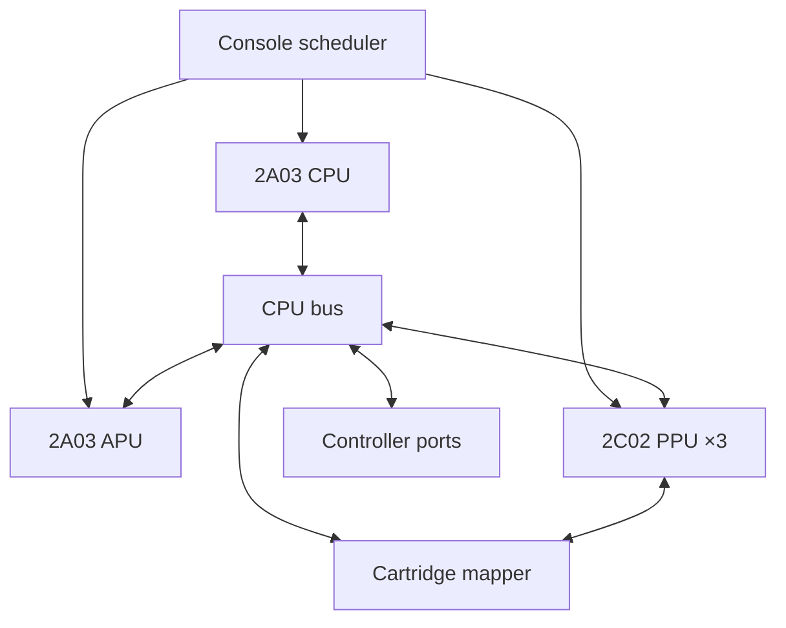

# Architecture

## Clock domains

The NTSC master schedule is represented in CPU-clock units. Every CPU clock
advances the APU once and the PPU three times:

Instructions are decoded as units, but the scheduler advances every cycle they
consume. DMA and DMC stalls hold the CPU while the PPU and APU continue
clocking. NMI and IRQ lines are sampled at the next instruction boundary.

The interactive scheduler has several semantics-preserving fast paths. Nearly
all official CPU opcode/mode pairs use direct handlers. CPU-only RAM/ROM
instruction spans coalesce their APU and PPU clocks until the next
device-register access, interrupt-visible APU/PPU event, DMA/DMC stall, mapper
edge, or frame boundary. Non-MMC3 spans may cross ordinary visible scanlines;
MMC3 projects its latch/counter/reload state across the PPU's filtered A12
schedule and stops only at the edge that can assert IRQ. The projection does
not mutate mapper state, evaluates at most the current and following phase,
then counts the remaining regular qualified edges in constant time.
Pre-render edges remain explicit. A
load-time NROM table, plus one table for each immutable 32 KiB mapping
provided by a discrete mapper or MMC2/MMC4, proves which instruction starts
can touch only mirrored CPU RAM, stack RAM, or mapped PRG ROM. Those
instructions use one inline CPU dispatcher until the same device deadline.
Each immutable start is preclassified as unsafe, statically safe, or guarded
official indirect. The hot dispatcher resolves the full decode-table object
only on a fallback path.

After the same immutable block start is observed eight times, the executor can
replace the compact dispatcher with a fixed Python function assembled from
internal opcode templates. The function keeps A/X/Y/P/SP, PC, open bus, and
cycles in locals across a basic block. Conditional branches, calls, returns,
and short control bridges can return directly into another hot block, while a
self-backward branch checks the hardware deadline after every logical 6502
instruction. The cache is bounded to 4,096 functions and is excluded from
serialized state. Reaching the bound preserves the established translated
working set; new starts continue through the compact safe dispatcher instead
of triggering a periodic whole-cache purge and recompilation wave. Official
`(d,X)` and `(d),Y` templates resolve the pointer at run time and return before
the opcode becomes visible if the effective or dummy address leaves mirrored
RAM or immutable PRG. Only source bytes from the already-proven immutable PRG
window select templates; no ROM text is evaluated, and no native-code or
external-emulator component is involved. Differential tests force every
supported official encoding through both the translated and literal paths.

Runtime generation is optional host work and is scheduled independently of
emulated clocks. The first two worker-reservoir frames permit at most four new
functions each; every later frame permits one. A hot start that exceeds the
budget receives a transient cache sentinel and uses the generic safe executor
for the rest of that frame. The next frame removes the sentinel and makes the
start eligible again. This bounds compilation tail latency without changing
6502 state, cycle counts, or the eventual hot working set.

A PRG-bank write swaps active window and table references; it is never
included in a batch. MMC3 additionally checks whether the current PC's 8 KiB
slot has a table even when the four active bank objects are unchanged. A first
control-flow entry records the immutable bank/slot identity and the following
scheduler boundary completes classification; once ready, the ordinary tuple
identity check remains the only refresh work. A device-safe span may cross an
MMC3 8 KiB boundary only when the destination already has a callable compiled
block, and at most eight such hot transitions share one deadline. Cold or
generic destinations return to the Console scheduler. Device-addressable
direct operands, unsafe resolved
indirect addresses, mapper writes, interrupt-unmasking instructions, DMA,
unofficial opcodes, and DMC paths are excluded. An implied opcode in the final
byte of an MMC3 8 KiB slot is also excluded because its discarded fetch comes
from the adjacent mapped bank. The last instruction may cross a device
deadline exactly as in the literal scheduler; device clocks flush before
another instruction begins.
A
cartridge-ROM `JMP` whose target is its own opcode may additionally batch
multiple identical iterations because it performs no writes and repeats the
same immutable reads. Register-counter loops made from `INX`, `DEX`, `INY`, or
`DEY` plus a backward `BNE` can batch only their taken, nonzero iterations.
Their final iteration and branch run literally. Both batches stop before NMI,
APU-frame, DMC-fetch, frame, and mapper IRQ boundaries; register access first
flushes every deferred clock. Immutable NROM and banked-window loop locations
are classified at load time so non-loop instructions do not pay speculative
PRG reads. The synchronized fast scheduler and dot renderer remain available
as references for differential tests.

A second immutable-loop classifier recognizes a four-record cooperative
scheduler scan made from `LDA zp,X`, a threshold branch, four `INX` operations,
`DEY/BNE`, and a jump through its setup. If X/Y are at the canonical scan
entry and all four RAM status fields take the idle branch, repeated 93-cycle
passes cannot observe a CPU-side change before the next interrupt. The batch
therefore advances whole passes arithmetically while retaining the final RAM
write, A/X/Y/P, PC, open bus, opcode, and cycle count. A ready field or any
interrupt uncertainty returns to literal execution.

Mapper 9 adds one narrower active-DMC rule for a preclassified
`load/compare/BIT RAM; taken branch back` wait. Internal RAM cannot change
without CPU execution, and the admitted loop contains no write or
interrupt-control instruction. The scheduler can therefore execute several
iterations and DMC requests together: CPU cycles advance the loop, every DMC
read contributes its separate four held physical clocks, and APU/PPU time
advances across both. The batch leaves one cycle before the nearest PPU/NMI or
APU-frame edge and rejects DMC IRQ, pending interrupt, OAM DMA, or changing-loop
cases.

OAM DMA retains its 513/514-cycle parity rule, but its held interval is one
device span because the CPU cannot observe instruction boundaries during it.
The APU and PPU still advance through every event, and DMC fetches add their
stalls in the same order. Mirrored internal-RAM pages and the 256-byte OAM
destination use bulk copies; side-effectful source pages keep literal reads.

## CPU

`cpu.py` contains:

- a 256-entry decode matrix derived from the NMOS 6502 electrical behavior;
- all addressing calculations, including zero-page wrapping and the indirect
  jump high-byte wrap;
- ALU and flag operations;
- stack, branch, reset, NMI, IRQ, and BRK paths; and
- stable unofficial compound read/modify/write instructions.

Decimal-mode state exists because the status bit exists, but ADC/SBC remain
binary because the Ricoh 2A03 has no functional BCD correction circuitry.

## CPU bus

| Address | Device |
| --- | --- |
| `$0000–$1FFF` | 2 KiB internal RAM, mirrored four times |
| `$2000–$3FFF` | Eight PPU registers, mirrored |
| `$4000–$4013` | APU channel registers |
| `$4014` | PPU OAM DMA |
| `$4015` | APU status/control |
| `$4016–$4017` | Controllers; `$4017` is also APU frame control on write |
| `$4020–$FFFF` | Cartridge expansion, RAM, mapper registers, and PRG ROM |

## PPU

The PPU owns separate pattern, nametable, and palette address spaces. Pattern
accesses are delegated to the cartridge mapper; nametable addresses pass
through the cartridge's current mirroring circuit.

Rendering uses the hardware-shaped pipeline:

1. Fetch nametable byte.
2. Fetch attribute quadrant.
3. Fetch low pattern plane.
4. Fetch high pattern plane.
5. Load 16-bit shifters and advance coarse X.
6. Transfer horizontal and vertical scroll components at their documented dots.
7. Combine background and first opaque sprite pixel by priority.
8. Resolve the six-bit palette index to host RGB.

The 256×240 RGB frame is a host artifact. Games only interact with PPU memory,
registers, status flags, and timing.

The interactive renderer memoizes three layers. A 512-pixel row spanning both
logical horizontal nametables is independent of viewport X, so side scrolling
usually becomes one wrapped slice. Viewport background pixels plus their
opacity mask are independent of OAM, and composed lines additionally include
sprites and status flags. Full viewport and composed rows are admitted only
after the exact frame signature repeats. A continuously scrolling or animated
scene therefore retains reusable world rows without allocating line objects
that would be evicted before the scroll wraps. After OAM changes, each sprite
is indexed only across the 8 or 16 scanlines it can touch. Nametable, palette,
CHR, mapper, and OAM writes invalidate the appropriate layer; these host-only
caches are excluded from save states.

Ordinary background and sprite rows request their low/high pattern planes
through one ordered mapper-pair call. Mappers whose reads have latching side
effects retain both reads in hardware order. The sprite compositor also
memoizes each `(low plane, high plane, horizontal flip)` row as compact
nontransparent `(offset, pixel)` pairs. Position, priority, palette, clipping,
sprite-zero timing, and overflow remain live per-scanline inputs; the bounded
pattern cache contains no machine state.

MMC3's eight 1 KiB CHR slots are represented as two precomputed four-bank
pattern-table tokens. The fast renderer tracks background and sprite
dependencies and generations independently. If a mapper write changes only
the sprite table, cached 512-pixel background world rows and viewport rows
remain valid; only composed sprite pixels and the sprite-zero overlap plan are
discarded. Lines with no selected sprites can replay directly. In 8x16 mode a
sprite may address either table, so its dependency conservatively contains
both tokens. Mirroring and the selected table remain part of the background
identity, and unknown mappers retain the conservative complete-token path.
The background and sprite halves of palette RAM use the same independent
identity, so a sprite-only color change does not discard background-only rows.
When no CPU-visible event intervenes, complete visible scanlines share these
identities and execute as one bounded PPU operation.

Mapper 9 requires side-effect-aware pattern caching because an MMC2 CHR read
can change the bank used by the next read. Its interactive path fetches the 33
tiles intersecting the scrolled viewport from left to right and reads each
low/high pattern pair before applying the resulting FD/FE latch edge. A
fetch-plan cache may reuse nametable, attribute, and pattern addresses. Plans
are packed into one 66-byte sequence—one little-endian address/attribute word
per tile—and the cache can retain one complete horizontal scroll cycle.
Completed tile runs are content-addressed by that full plan, palette/mask, all
four FD/FE CHR bank bases, and the incoming latches. A hit restores the exact
outgoing latch state, so reuse cannot suppress an FD/FE transition. Unchanged
complete lines remain in the persistent framebuffer and replay only their
recorded status/latch result. MMC2 replay keys use versions for only the two
physical tile rows and attribute rows fetched by that scrolled line, so an
unrelated nametable write does not invalidate the entire retained frame.
Mirroring, CHR, palette, mapper registers, scroll, sprites, and latch state
remain explicit dependencies; unknown changes use a conservative global
fallback. Any relevant key change composes the line normally. The dot renderer
goes through the same mapper semantics one access at a time.

The reference sprite pipeline evaluates secondary OAM at hardware dots,
including the post-eighth-sprite diagonal increment bug that can create false
overflow. The fast path computes the same scanline-visible overflow and
sprite-zero event time while composing a line once. Both routes share the
VBlank/NMI race rules and are checked against the same public timing suites.

## APU

Each channel retains its own timer and control units. Quarter-frame clocks
advance envelopes and the triangle linear counter. Half-frame clocks additionally
advance length counters and pulse sweeps. Channel DAC values enter the two
measured nonlinear mixing formulas, followed by the NES's first-order 90 Hz
and 440 Hz high-pass stages and 14 kHz low-pass stage. Bilinear-transform
coefficients are derived once for the negotiated host rate, and all three
scalar recurrences remain inline in the mixer.

DMC reads go back through the CPU bus and request four held CPU clocks per
sample fetch.

Between frame-sequencer, host-sample, and DMC-fetch events, timer dividers are
advanced with integer arithmetic. Large spans recursively split immediately
before a frame-sequencer edge and clock only that edge literally. When the DMC
cannot request memory, a dedicated span avoids recomputing an impossible fetch
deadline for every host sample. A long no-fetch span copies pulse, triangle,
noise, DMC, nonlinear-mixer, and all three filter stages into locals, produces
every host sample in the original arithmetic order, and publishes once at the
end. Spans shorter than four host-sample intervals keep the smaller event
helper so mapper-register bursts do not pay the larger setup cost. Both routes
produce the same samples and serialized channel/filter state. Inaudible
channel timers advance once across the full quiet span; silent DMC bit clocks
and noise LFSR clocks collapse in exact repeating groups before their
remainders are applied.
The pulse and triangle/noise/DMC nonlinear DAC equations are expanded into
small immutable lookup tables once at import, preserving the hardware formulas
while removing divisions from each generated host sample. Muted and
noninteractive modes set the host sampling rate to zero; channel timers,
sequencer events, IRQs, and DMC reads continue normally, but unused PCM values
are not mixed or retained.

## Cartridge boundary

`Cartridge` parses the 16-byte file header and owns immutable PRG ROM, CHR
ROM/RAM, optional PRG RAM, and exactly one mapper. Mappers translate CPU and PPU
addresses; they do not reach into the CPU or renderer.

Adding a mapper means implementing:

- `cpu_read` / `cpu_write`;
- `ppu_read` / `ppu_write` when CHR banking differs;
- `ppu_read_pair` and `ppu_reads_have_side_effects` when ordered pattern reads
  alter later mapping;
- `ppu_pattern_cache_token` when independently banked pattern-table regions
  can preserve one another's cached pixels;
- dynamic `mirroring` when present;
- `notify_ppu_address` for scanline IRQ hardware; and
- complete mapper state serialization.

Mappers with a finite set of immutable CPU mappings may additionally expose
`cpu_code_windows` and `cpu_code_window`. The bus then gives the CPU a direct
active 32 KiB view and refreshes it immediately after a mapper write or state
restore. `ppu_cache_token` identifies only render-visible state, so a PRG-only
bank change or ordinary PRG-RAM write does not discard video caches while a
CHR or mirroring change does. This comparison applies across the complete
cartridge register range, including NINA/Jaleco registers below `$8000`.

## State format

Save states use a versioned JSON envelope, binary-to-base85 conversion, and
zlib compression behind a fixed magic signature. No `pickle` input is accepted.
Writes use a temporary file plus atomic replacement. Every state records the
SHA-256 of the full cartridge image, preventing accidental restoration into a
different game or ROM revision.

Rewind is a separate, trusted in-process mechanism. After sustained producer
headroom, the console-owning worker freezes a primitive snapshot and encodes
it to immutable pickle bytes at the configured six-frame cadence. A dedicated
convenience thread performs zlib compression and publishes the result to the
bounded 30-second ring, so compression cannot block video or PCM production.
Internal snapshots contain only objects that Cartaconda itself just created;
no pickle bytes are read from disk or accepted from a user. Stopping the
emulation worker drains every accepted compression job before a save, restore,
ROM replacement, or shutdown reads mutable state. A rewind restore then
verifies ROM identity, restores the selected snapshot, discards future
history, restarts the worker, and flushes host PCM. Battery persistence is
outside the snapshot ring, so rewinding cannot write an older battery image to
disk.

## Host frontend

The emulation core has no dependency on Pygame. `frontend.py` is the host
adapter for display, mixer, keyboard, mouse, and controller devices, while
`ui_model.py` owns validated preferences and read-only filesystem inventories.
This boundary keeps launcher behavior, recent ROMs, save-state thumbnails,
volume, resolution, and remappable keyboard/gamepad controls out of serialized
NES hardware state. Gamepad preferences store bounded SDL-event source
descriptors (`button`, signed `axis`, or directional `hat`) per player and
compile them into Python bit-mask tables when settings change.

Cartaconda's supplied pixel logo is installed as package data. The frontend
loads it once after display initialization, derives fixed nearest-neighbor
wordmark and mascot crops for the launcher, and uses the mascot as the window
icon. Missing or unreadable artwork falls back to code-drawn branding without
affecting the emulator core.

During active gameplay, `emulation_worker.py` exclusively owns the mutable
Console on a pure-Python worker thread. It publishes ordered video, PCM, timing,
and frame-number packets through a two-frame bounded queue backed by two
reusable RGB buffers. The main thread applies the newest cached
keyboard/gamepad snapshot at each emulated frame boundary. Stopping, pausing,
resetting, saving/loading state, replacing a ROM, or shutting down joins the
worker before the main thread accesses mutable core state. The interpreter
switch interval is temporarily set to 5 ms while the worker runs, then
restored. Testing showed that the earlier 1 ms value caused excessive GIL
handoffs against the two-millisecond host pump; the bounded queue provides the
variance reservoir without that scheduler tax. A newly started empty queue
receives one additional frame period before its first presentation deadline so
cold render caches do not create an artificial startup repeat.

The frontend drains packetized APU output into a bounded host-only PCM buffer.
Playback waits for a two-chunk reservoir, then a small pump keeps Pygame's
current and queued slots filled with fixed 2,048-sample Sounds. The same
4,096-sample startup reservoir is retained, while the two native slots now
cover about 93 ms at 44.1 kHz instead of 46 ms. The SDL mixer uses a
2,048-sample power-of-two buffer. The pump runs when each completed frame
arrives and at two-millisecond intervals while waiting for either the worker
or the next display deadline. Samples remain staged when both mixer slots are
occupied. A genuine underrun waits for the reservoir to rebuild before
restarting; an exceptional
backlog retains the newest four chunks and restarts the channel to bound
latency. Frontend deadlines use the fractional NTSC frame rate, preventing a
nominal 60 Hz loop from slowly starving a 60.0988 Hz audio producer. The mixer
remains signed 16-bit mono; if the device negotiates a different sampling
frequency, the APU producer adopts it, including after loading a state created
on another host. Pygame Sound objects remain strongly referenced while current
or queued, and teardown stops the channel before releasing those references.
Every playback submission uses `Channel.queue()`. When the channel is active it
fills SDL_mixer's one next slot; when idle the same operation starts the Sound
immediately. This single atomic native entry point removes the check-then-start
race and avoids both `Sound.play()` channel selection and pygame-ce 2.5.7's
unsafe explicit `Channel.play()` failure path. A queued Sound observed while
`get_busy()` is transiently false is a healthy native promotion and is never
stopped or replaced. Cartaconda requires 12 ms of stable idle/no-queue state
before counting a real underrun. A failed submission remains staged and is
retried at the next service point. Each native submission receives an
immutable PCM owner and remains staged until the mixer accepts it.

The PPU owns one mutable 256×240 RGB bytearray for its full lifetime. The worker
copies each completed frame into one of two fixed transfer bytearrays. The main
thread copies that packet into a third stable bytearray bound to one long-lived
Pygame Surface, then immediately returns the transfer buffer. This single
bounded copy prevents the PPU and SDL from sharing a concurrently mutated
buffer and avoids all per-frame framebuffer and Surface allocation.
Default/core callers still receive immutable frame bytes.
When active gameplay begins, cyclic garbage collection is deferred; it resumes
and performs a young-generation collection after entering a menu, outside
audio deadlines.

`rom_loader.py` accepts either a raw image or a selected `.nes` member inside a
ZIP. Archive bytes are decompressed directly into bounded memory and are never
written to the filesystem. Single-ROM archives resolve automatically;
multi-ROM archives return an explicit selection requirement for either the
frontend picker or `--zip-member`. Cartridge SHA-256 identity is calculated
from the decompressed ROM, so save states and battery RAM remain compatible
with the same image loaded outside the archive.

The pixel-art menu renders to a fixed 960×720 logical surface, then scales with
nearest-neighbor sampling and letterboxes into the selected host resolution.
Gameplay continues to scale the 256×240 PPU frame directly. Opening any menu
stops emulated time and clears both controller ports; returning to the game
resumes on the next frame boundary.

Active gameplay uses a fractional-NTSC deadline rather than an integer 60 Hz
clock. On Windows, an accelerated SDL renderer owns one streaming 256×240 game
texture. A changed frame uploads at native resolution and the GPU performs the
nearest-neighbor scale into the letterboxed destination; menu screens use a
separate full-window texture. Unsupported renderer creation falls back to the
portable Surface path, which estimates scale/present cost, prepares the
software-scaled frame before its lead point, and leaves only `display.flip()`
on the deadline. Every emulated frame is presented. When a worker result is
exceptionally unavailable at the draw boundary, the frontend repeats the last
complete frame instead of exposing a partial PPU buffer or changing emulation
speed.

Deadlines advance from the prior absolute deadline by one exact NES period.
Host lateness is never added to a recovery accumulator and never changes the
emulated rate. Menus, state transitions, display changes, and exceptional
system-suspend/debugger gaps start a new timing segment. Coarse sleeping ends
with a bounded 0.35 ms precision tail to reduce host scheduler overshoot. Exact
scroll-background cache entries use bounded LRU eviction, avoiding a periodic
full-cache destruction spike during continuous scrolling. A recurring Mapper
4 map admits one third of its double-width world rows on the first appearance
and the remainder on the second; deferred lines use the exact visible-viewport
renderer.

All SDL-backed resources are owned and released by the frontend's main thread;
the emulation worker never imports or calls Pygame.
Display and font initialize explicitly; mixer and joystick initialize only when
requested, so `--mute` and `--no-gamepad` genuinely avoid those drivers.
Joystick add/remove, button, hat, and axis events maintain pure-Python input
state; the frame loop does not poll native device handles. Shutdown stops and
quits the mixer, quits live joystick handles and their subsystem, releases
textures before their renderer and window, drops fonts and Surfaces while
video is still initialized, then quits display and Pygame.
`--diagnostics`, `--mute`, and `--no-gamepad` expose the native subsystem
boundaries without changing emulated hardware state.
Diagnostics separate emulation, drawing, and total active-loop time, report
emulation wall-time p95/p99 tails plus worker thread-CPU average/max, count
deadlines at least 1 ms late, and report presented frames, presentation jitter
p95/max, worker queue high-water and starvation, legacy zero-valued
presentation-skip/debt fields, and audio underruns. Comparing wall and
thread-CPU time distinguishes actual core work from OS/GIL descheduling.
Version 2.2.3 adds the current number of cached hot Python blocks as
`cpu-translated-blocks`; it should stabilize after the active banked working
set warms. Version 2.2.4 adds `ppu-mapper-background-preserves`, the number of
mapper invalidations whose effective background table and mirroring remained
unchanged. Version 2.2.5 adds `ppu-palette-background-preserves`, the number of
sprite-only palette writes that retain background-only scanlines. Version
2.2.6 makes `cpu-bank-compiles` include a newly executed stable MMC3
slot even when no bank-register write accompanies the control-flow entry.
Version 2.2.7 adds `cpu-block-deferrals` for optional hot-block generation that
yielded to an empty producer queue, `rewind-captures` for completed convenience
snapshots, and `audio-concealments`/`audio-recovery-fades` for the two sides of
an already-detected native underrun. Sparse nametable writes retain the world
cache because exact physical tile/attribute row versions remain in every key;
unversioned dependencies still perform conservative invalidation.
Version 2.2.8 replaces the queue gate with the deterministic per-frame budget
described above. `cpu-block-compile-peak` reports the largest number generated
in one frame: up to four during the first two reservoir-fill frames and one
during gameplay. Deferrals now count unique budget-deferred starts per frame.
Persistent native start failures remain in
`audio-start-failures`, while a recovered single-start race is not counted as
an audible failure.
Version 3.0 adds world-cache miss/eviction/admission/size counters,
`rewind-compression-deferrals`, and the host-audio
`audio-handoff-waits`/`audio-grace-restarts` pair. Handoff waits and grace
restarts are lossless transitions; only `audio-underruns` means the native
channel remained empty long enough to create a confirmed gap.
